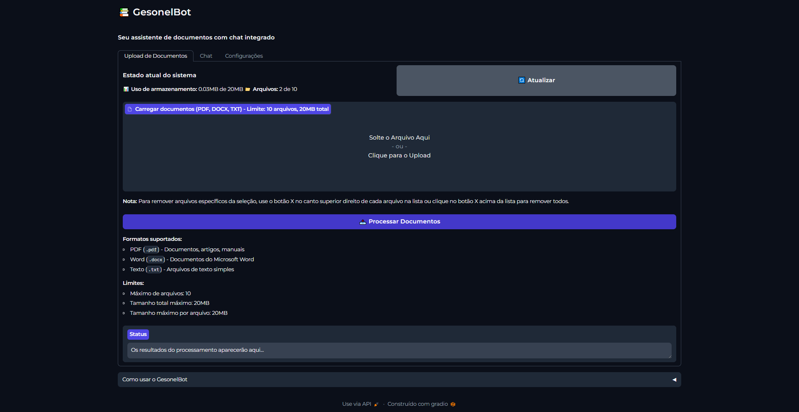
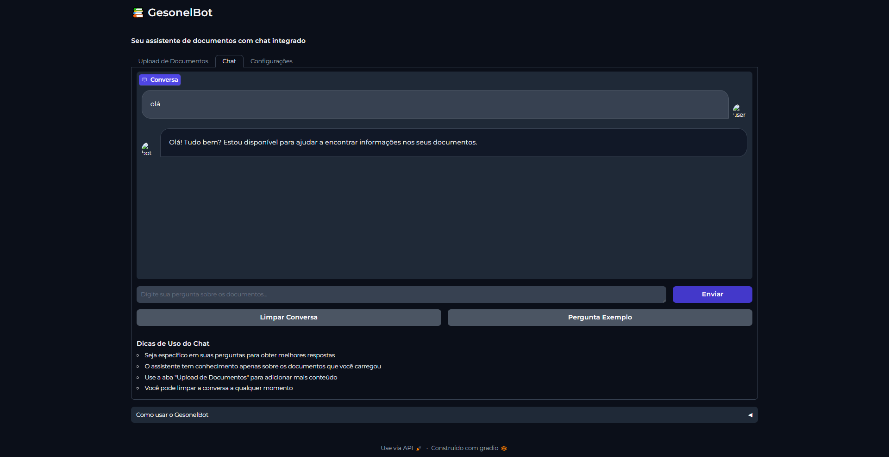
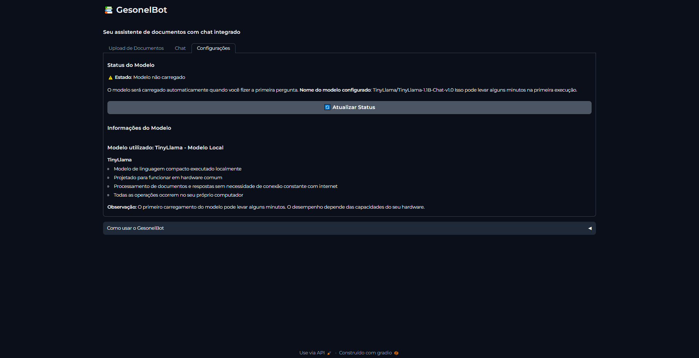

# GesonelBot 🤖 (Em desenvolvimento)

Um chatbot com IA para responder perguntas com base em documentos locais.

## 📖 Sobre

GesonelBot é um chatbot que utiliza processamento de linguagem natural e recuperação de informações para responder a perguntas com base em documentos locais. Diferente de outras soluções, o GesonelBot funciona 100% localmente em seu computador, sem enviar seus dados para serviços externos.

## 📸 Screenshots

### Interface de Chat


### Upload de Documentos


### Upload de Documentos



## ✨ Funcionalidades

- 🏠 **Totalmente Local**: Todo o processamento ocorre em sua máquina
- 📄 **Suporte a Múltiplos Formatos**: PDF, DOCX, TXT e mais
- 🔍 **Busca Semântica**: Encontra informações relevantes mesmo quando não há correspondência exata
- 🧠 **Modelo TinyLlama**: Utiliza um modelo de linguagem eficiente que funciona em hardware comum
- 🔄 **Processamento em Lote**: Processe múltiplos documentos de uma vez
- 🌐 **Interface Web**: Interface amigável baseada em Gradio

## 🖥️ Requisitos

- Python 3.8 ou superior
- Windows, MacOS ou Linux
- Mínimo de 4GB de RAM (8GB recomendado)
- Aproximadamente 2GB de espaço em disco para o modelo

## 🚀 Instalação

### Método Rápido (Windows)

1. Clone o repositório:
   ```
   git clone https://github.com/seuusuario/GesonelBot-LocalChat-Bot.git
   cd GesonelBot-LocalChat-Bot
   ```

2. Execute o script de configuração:
   ```
   scripts\setup.bat
   ```

3. Inicie o aplicativo:
   ```
   scripts\executar.bat
   ```

### Instalação Manual

1. Clone o repositório:
   ```
   git clone https://github.com/seuusuario/GesonelBot-LocalChat-Bot.git
   cd GesonelBot-LocalChat-Bot
   ```

2. Crie um ambiente virtual:
   ```
   python -m venv venv
   ```

3. Ative o ambiente virtual:
   - Windows: `venv\Scripts\activate`
   - Mac/Linux: `source venv/bin/activate`

4. Instale as dependências:
   ```
   pip install -r requirements.txt
   ```

5. Copie o arquivo de configuração:
   ```
   cp env.example .env
   ```

6. Inicie o aplicativo:
   ```
   scripts\executar.bat
   ```

## 📝 Uso

1. Acesse a interface web em `http://localhost:7860`
2. Na aba "Upload de Documentos", carregue seus arquivos
3. Clique em "Processar Documentos"
4. Vá para a aba "Chat" e comece a fazer perguntas sobre seus documentos

## 🔧 Configuração

O comportamento do GesonelBot pode ser personalizado através do arquivo `.env`:

- `LOCAL_MODEL_NAME`: O modelo Hugging Face a ser utilizado (padrão: TinyLlama/TinyLlama-1.1B-Chat-v1.0)
- `CHUNK_SIZE`: Tamanho dos fragmentos de texto para processamento (padrão: 1000)
- `CHUNK_OVERLAP`: Sobreposição entre fragmentos (padrão: 200)
- `QA_MAX_TOKENS`: Número máximo de tokens na resposta (padrão: 512)
- `QA_TEMPERATURE`: Temperatura para geração de resposta (padrão: 0.7)

## 🛠️ Arquitetura

GesonelBot utiliza uma arquitetura moderna para processamento de documentos e resposta a perguntas:

1. **Processamento de Documentos**: Os documentos são carregados, divididos em chunks e convertidos em embeddings
2. **Armazenamento Vetorial**: Os embeddings são armazenados em um banco de dados ChromaDB local
3. **Recuperação de Informações**: Quando uma pergunta é feita, o sistema recupera os chunks mais relevantes
4. **Geração de Resposta**: O modelo TinyLlama gera respostas com base nos chunks recuperados e na pergunta do usuário

## 📄 Licença

Este projeto está licenciado sob a [MIT License](LICENSE).

## 🙏 Agradecimentos

- [LangChain](https://github.com/langchain-ai/langchain) pelo framework de processamento de documentos
- [Hugging Face](https://huggingface.co) pela biblioteca Transformers e modelos
- [TinyLlama](https://github.com/jzhang38/TinyLlama) pelo modelo eficiente de linguagem
- [Gradio](https://github.com/gradio-app/gradio) pela interface web
